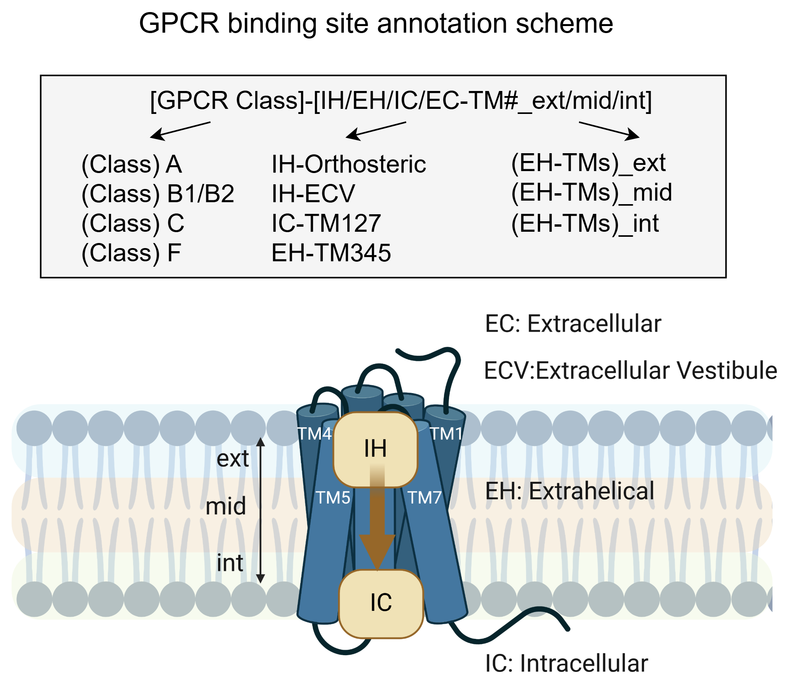

# gpcr POCket ANNotationS (pocannos)

---

This repository contains Python code to annotate GPCR binding sites following the procedure published in:

**"Comparative Study of Allosteric GPCR Binding Sites and Their Ligandability Potential"**\
[Publication Link](https://pubs.acs.org/doi/10.1021/acs.jcim.4c00819)



The GPCR pocannos includes:

- Receptor class
- Transmembrane contacts
- For membrane-facing sites: membrane location

---

## Installation and Use

Move to the folder in the terminal where pocannos (1GB) should be installed.

### Clone the Repository

```bash
git clone https://github.com/sonjapeter/pocannos.git
cd pocannos
```

### Create, Install and Activate a Conda Environment

```bash
conda create -n pocannos_env python=3.9 --file requirements.txt -y
conda activate pocannos_env
```

---

## External Dependencies

This code upload structures to the **GPCRdb generic residue numbering API** ([GPCRdb](https://gpcrdb.org/)). Please modify code to point to the local version of GPCRdb if used for internal structures. The **OPM reference files** are included in the `opm_database` folder. For additional membrane position references, visit the **OPM database** ([OPM Reference](https://opm.phar.umich.edu/ppm_server3_cgopm)). 

---

## Scripts

### `pocannos.py`

This script allows a user to pass a CSV file containing the residues of a pocket of interest and returns a CSV file with the GPCR pocannos annotations in the column "Site".

```bash
cd scripts
python ./pocannos.py --help
```

#### Add GPCR pocannos to a CSV file

```
Usage: python pocannos.py <csv_file> <output_folder> [threshold] [residues_ortho]

Arguments:
csv_file
                Path to file containing one row per binding site
output_folder
                Path to the output folder

Optional Arguments:
-h, --help      Show this help message and exit
threshold_clustering
                A float value between 0 and 1 can be used to cluster binding sites
                (default: every site treated as separate cluster)
residue_ortho
                A list of residues that define the orthosteric site
                (default: orthosteric major and minor pocket residues:
                1.39, 2.53, 2.56, 2.57, 2.60, 2.64, 3.32, 3.33,
                3.35, 3.36, 45.52, 5.43, 6.48, 6.51, 6.52, 6.55,
                7.38, 7.39, 7.42, 7.46)
```

---

## Tutorial

```bash
conda activate pocannos_env
cd scripts
python ./pocannos.py folder_path_pocannos/data/Minimal_file_drd1.csv folder_path_pocannos/output
```

**Side note:** The folder containing the `csv_file` should also include the corresponding `input_structure.pdb`. The `input_structure.pdb` should have the same name as in the `csv_file` column called "PDB".

---

## License

This project is licensed under the MIT License.

## Contact

For any inquiries, please contact sonja.peter3@hispeed.ch.


